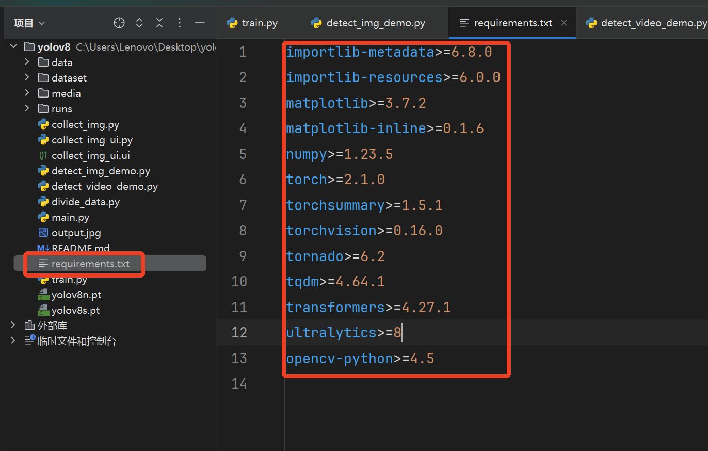
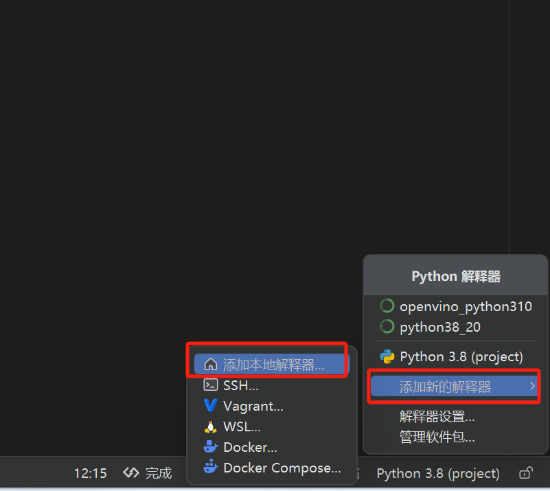
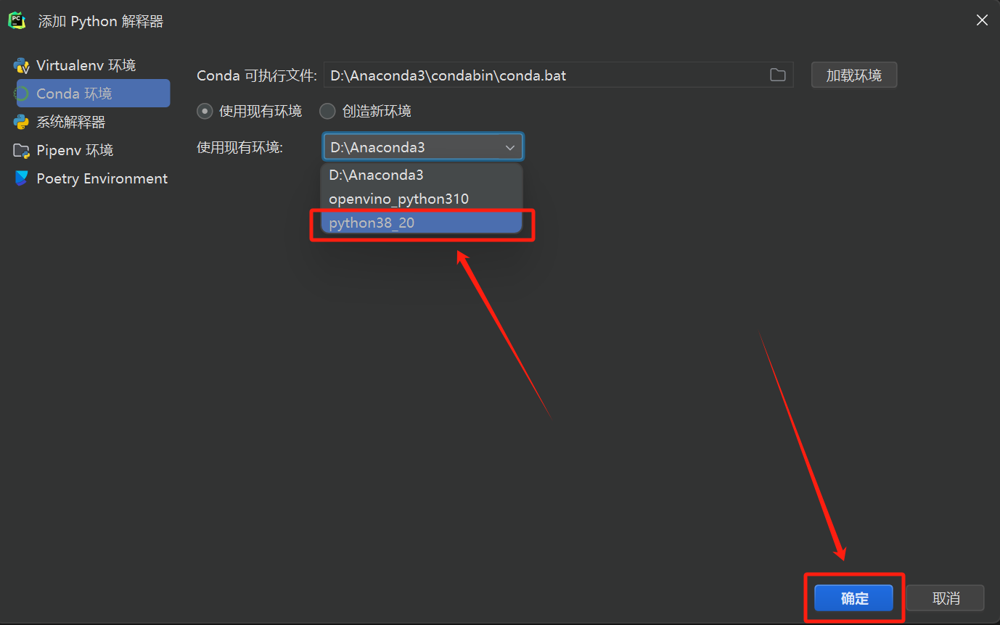
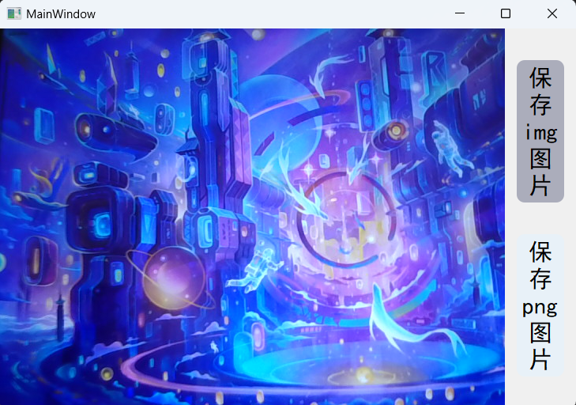
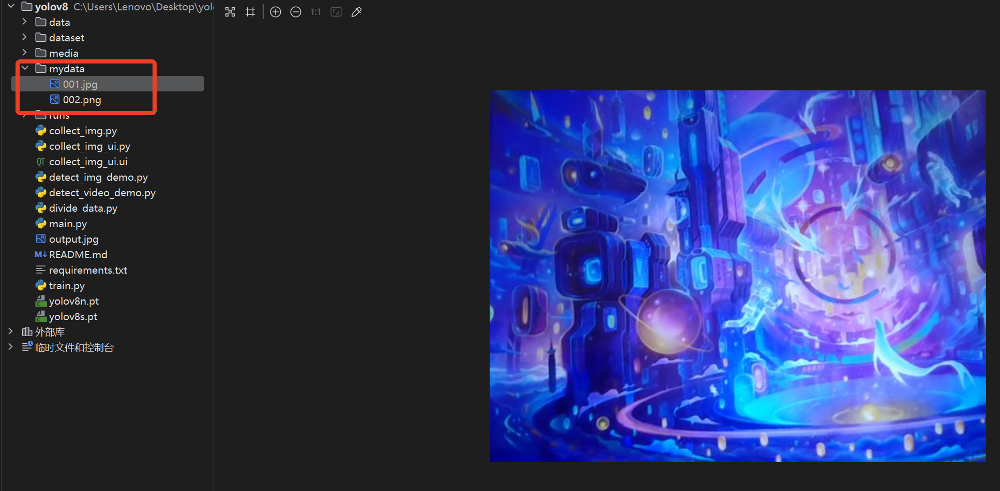
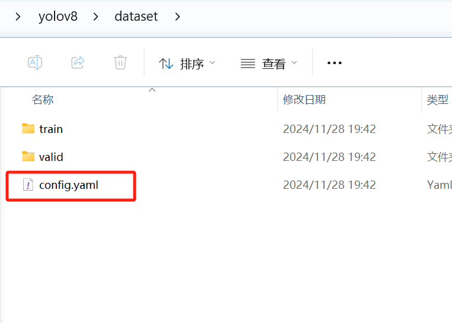
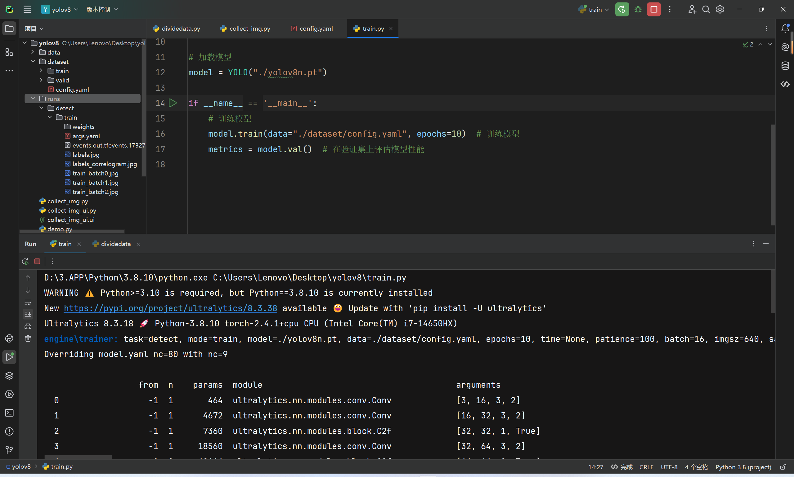
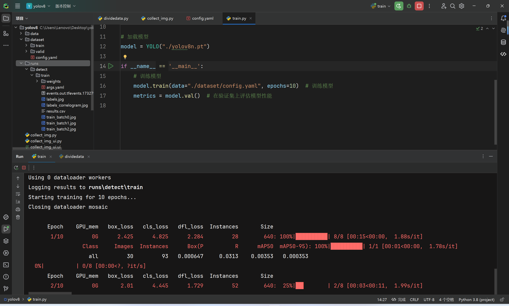
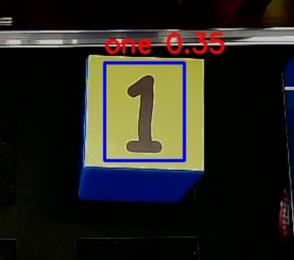
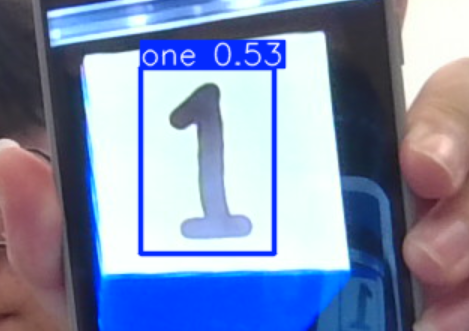

# YOLOV8 训练

## 环境配置

### Anaconda创建虚拟环境

首先打开Anaconda命令窗，新建名叫yolo_env的虚拟环境，这里以python3.8为例

```
conda create -n yolo_env python=3.8 -y
```

进入虚拟环境

```
conda activate yolo_env
```

安装pytorch，这里可以在pytorch官网找到对应的版本下载命令（https://pytorch.org/get-started/previous-versions/）
这里以pytorch2.1+CUDA11.8为例

```
pip install torch==2.1.0 torchvision==0.16.0 torchaudio==2.1.0 --index-url https://download.pytorch.org/whl/cu118
```

安装ultralytics（官方推荐）

```
pip install ultralytics
```

### 一键安装指令

或者执行下面的命令：

```bash
# 进入到项目文件夹中
pip install -r requirements.txt
```



pycharm配置Python环境，点击右下角解释器->添加新的解释器->添加本地解释器



弹出框汇总选择现有->选择解释器路径。



## YOLOV8数据集格式

yolov8需要的数据集格式组织如下：

```
├── yolov8_dataset
	└── train
		└── images (folder including all training images)
		└── labels (folder including all training labels)
	└── test
		└── images (folder including all testing images)
		└── labels (folder including all testing labels)
	└── valid
		└── images (folder including all validing images)
		└── labels (folder including all validing labels)
```

## 采集数据

**该程序是调用外部摄像头采集数据**，运行collect_img.py文件，注意`SAVE_PATH`变量修改为自己想要保存数据集的路径，**注意：**外接摄像头需要将`self.cap = cv2.VideoCapture(0)`改为`self.cap = cv2.VideoCapture(1)`

```python
# -*- coding: UTF-8 -*-
"""
@Project ：yolov8 
@File    ：collect_img.py
@IDE     ：PyCharm 
@Author  ：MFK
@Date    ：2024/11/28 下午5:10
"""

import os
import sys
import cv2
from PyQt5.QtGui import *
from PyQt5.QtCore import *
from PyQt5.QtWidgets import *
from collect_img_ui import Ui_MainWindow

# 设置保存图片的目录
SAVE_PATH = "./mydata/"
if not os.path.exists(SAVE_PATH):
    os.makedirs(SAVE_PATH)


# 自定义 QT 线程类
class MyThread(QThread):
    def __init__(self, function, parent=None):
        super(MyThread, self).__init__(parent)
        self.function = function
        self.start()

    def run(self):
        self.function()


class MyWindow(QMainWindow, Ui_MainWindow):
    def __init__(self):
        super(MyWindow, self).__init__()
        self.setupUi(self)
        self.frame = None
        self.save_jpg_img_flag = False
        self.save_png_img_flag = False
        self.count = 0

        self.cap = cv2.VideoCapture(0)
        if not self.cap.isOpened():
            print("Cannot open camera")
            exit()

        self.showimg_thread = MyThread(self.show_video)

    def save_jpg_img(self):
        self.count += 1
        self.save_jpg_img_flag = True

    def save_png_img(self):
        self.count += 1
        self.save_png_img_flag = True

    def show_video(self):
        while True:
            # 逐帧捕获
            ret, self.frame = self.cap.read()
            # 如果正确读取帧，ret为True
            if not ret:
                print("Can't receive frame (stream end?). Exiting ...")
                break
            # 将捕获到的帧 BGR --> RGB --> QImage格式
            self.frame = cv2.cvtColor(self.frame, cv2.COLOR_BGR2RGB)
            self.frame = QImage(self.frame.data.tobytes(), self.frame.shape[1], self.frame.shape[0],
                                QImage.Format_RGB888)
            if self.save_jpg_img_flag:
                self.save_jpg_img_flag = False
                self.frame.save(SAVE_PATH + f"{self.count:03}.jpg")
            elif self.save_png_img_flag:
                self.save_png_img_flag = False
                self.frame.save(SAVE_PATH + f"{self.count:03}.png")
            # 显示在label标签上
            self.label_img.setPixmap(QPixmap.fromImage(self.frame))


if __name__ == '__main__':
    app = QApplication(sys.argv)
    MainWindow = MyWindow()
    MainWindow.show()
    sys.exit(app.exec_())

```

界面显示如下，**注意：**在进行数据采集时，只能选择一种格式，否则在进行分割训练和测试集的时候会缺失数据



运行结果：



## 分割训练数据集

这里我们需要将我们的数据整理成yolov8所需要的形式，运行divide_data.py：

```python
"""
@Project ：demo2.py
@File    ：divide_data.py
@IDE     ：PyCharm
@Author  ：MFK
@Date    ：2024/8/13 下午3:34
"""

import os
import random
import shutil

# 需要分割的图片目录
SOURCE_IMG_DIR = 'C:\\Users\\Lenovo\\Desktop\\yolov8\\data'

# 识别分割图片类型"jpg", "png"
file_type = False

# # 定义数据集目录和分割比例
source_root = SOURCE_IMG_DIR
target_root = 'data'
train_ratio = 0.8
valid_ratio = 0.2

# 创建目标文件夹及其子文件夹
train_dir = os.path.join(target_root, "train")
valid_dir = os.path.join(target_root, "valid")

for phase in ['train', 'valid']:
    os.makedirs(os.path.join(target_root, phase, 'images'), exist_ok=True)
    os.makedirs(os.path.join(target_root, phase, 'labels'), exist_ok=True)

# 获取所有文件列表
files = os.listdir(source_root)

if files[0].split('.')[1] == "jpg" or files[1].split('.')[1] == "jpg":
    png_files = [f for f in files if f.endswith(".jpg")]
    file_type = True
    print(len(png_files))
else:
    png_files = [f for f in files if f.endswith(".png")]
    print(len(png_files))

# 随机打乱文件列表
random.shuffle(png_files)

# 计算分割点
num_files = len(png_files)
num_train = int(train_ratio * num_files)

# 移动文件到目标位置
# 将文件复制到相应目录
for i, file in enumerate(png_files):
    file = file.split('/')[-1].split('.')[-2]
    if file_type:
        image_path = os.path.join(source_root, file + '.jpg')
    else:
        image_path = os.path.join(source_root, file + '.png')
    label_path = os.path.join(source_root, file + '.txt')
    print(image_path)
    print(label_path)
    if i < num_train:
        dst_dir = train_dir
    else:
        dst_dir = valid_dir
    # 复制到目标文件夹
    shutil.copy(image_path, os.path.join(dst_dir, 'images'))
    shutil.copy(label_path, os.path.join(dst_dir, 'labels'))

```

## 训练

在dataset中新建config.ymal文件进行编辑



加入以下内容，其中**路径需要改为自己的路径**，这里为了避免错误使用了绝对路径

```yaml
# 数据集路径
train: C:\\Users\\Lenovo\\Desktop\\yolov8\\dataset\\train
val: C:\\Users\\Lenovo\\Desktop\\yolov8\\dataset\\valid

# 类别数量
nc: 9

# 类别
names:
  0: one
  1: two
  2: three
  3: four
  4: five
  5: six
  6: seven
  7: eight
  8: nine

```

.yaml文件是yolov8的训练配置文件，其中规定了训练集、验证集、测试集的路径，规定了要识别的类别

运行train.py文件即可进行训练。
```python
"""
@Project ：yolo_demo
@File    ：train.py
@IDE     ：PyCharm 
@Author  ：MFK
@Date    ：2024/8/11 下午4:22 
"""

from ultralytics import YOLO

# 加载模型
model = YOLO("./yolov8n.pt")

if __name__ == '__main__':
    # 训练模型
    model.train(data="./dataset/config.yaml.yaml", epochs=10)  # 训练模型
    metrics = model.val()  # 在验证集上评估模型性能

```
这里使用了最轻量的yolov8n例，此外还有YOLOv8s、YOLOv8m、YOLOv8l、YOLOv8x，参数量依次增大，在最轻量版本下只需2.25G左右的显存。
.pt为预训练权重文件可以在(https://github.com/ultralytics/assets/releases)下载, 单独运行`model = YOLO("yolov8n.pt")`也会自动下载。
运行后会提供一系列信息，运行结果将保存在runs文件夹下。





## 预测

### 图片预测

执行detect_img_demo.py，可以获得预测结果（前提是已经做过训练）：

```python
# -*- coding: UTF-8 -*-
"""
@Project ：yolov8 
@File    ：detect_img_demo.py
@IDE     ：PyCharm 
@Author  ：MFK
@Date    ：2024/11/28 下午7:46 
"""

from ultralytics import YOLO
import cv2

model = YOLO("runs/detect/train/weights/best.pt")
frame = cv2.imread("data/6.jpg")

results = model(frame)
# 获取检测结果
res = results[0].boxes.data.to('cpu').numpy()

# 遍历检测结果
for x1, y1, x2, y2, conf, cls in res:
    # 检查置信度是否满足阈值
    # if conf > 0.7:
    # 提取边界框坐标Q
    x1, y1, x2, y2 = map(int, (x1, y1, x2, y2))
    # 获取类别名称
    label = model.names[int(cls)]
    # 绘制边界框和标签
    cv2.rectangle(frame, (x1, y1), (x2, y2), (255, 0, 0), 2)  # 绿色矩形框，线宽为2
    cv2.putText(frame, f'{label} {conf:.2f}', (x1, y1 - 10), cv2.FONT_HERSHEY_SIMPLEX, 0.8, (0, 0, 255),
                2)  # 在框上方显示标签和置信度
    cv2.imwrite("output.jpg", frame)

```

结果如下：



### 视频预测

执行detect_video_demo.py，可以获得预测结果（前提是已经做过训练）：

```python
"""
@Project ：yolo_demo
@File    ：detect_video_demo.py
@IDE     ：PyCharm
@Author  ：MFK
@Date    ：2024/8/6 上午9:57
"""

import cv2
from ultralytics import YOLO

# 加载模型
model = YOLO('./yolov8n.pt')  # 请确保路径正确


if __name__ == "__main__":
    cap = cv2.VideoCapture(0)
    if not cap.isOpened():
        print("Cannot open camera")
        exit()
    while True:
        # 逐帧捕获
        ret, frame = cap.read()
        # 如果正确读取帧，ret为True
        if not ret:
            print("Can't receive frame (stream end?). Exiting ...")
            break

        # 进行人体姿态检测
        results = model(frame)
        frame = results[0].plot()

        cv2.imshow("Person-Pose", frame)
        if cv2.waitKey(1) == ord('q') or cv2.waitKey(1) == ord('Q'):
            break

        # 完成所有操作后，释放捕获器
    cap.release()
    cv2.destroyAllWindows()

```

结果如下：

